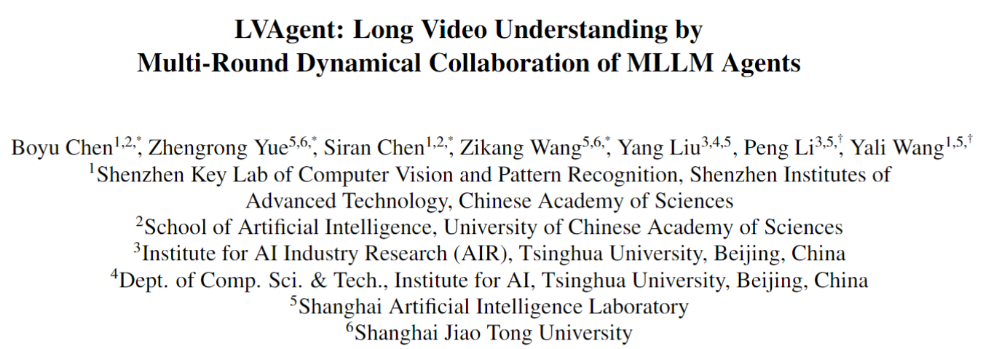
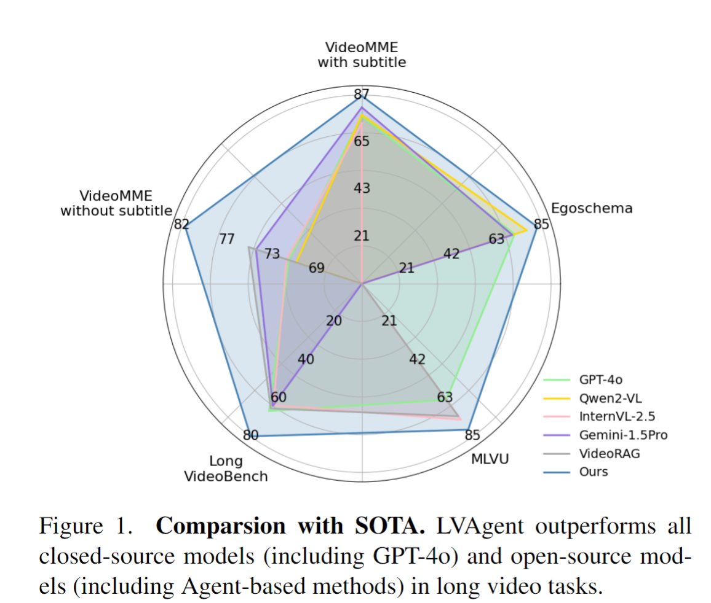
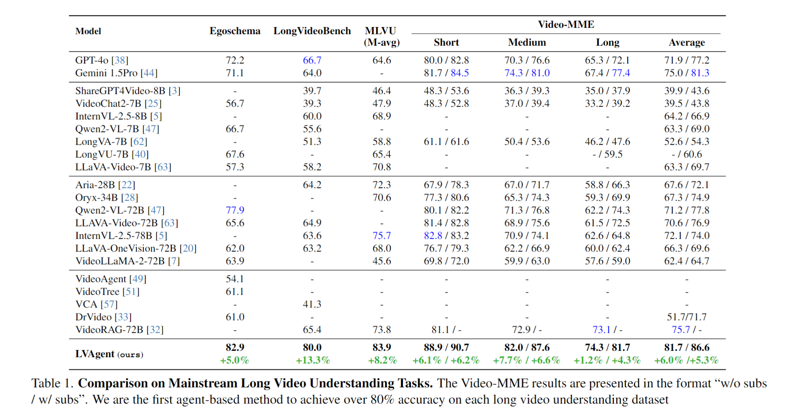
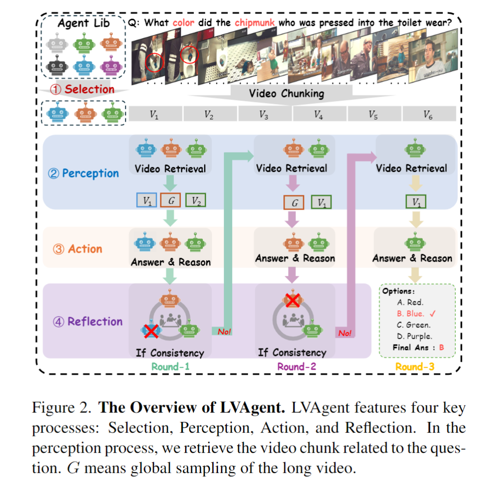
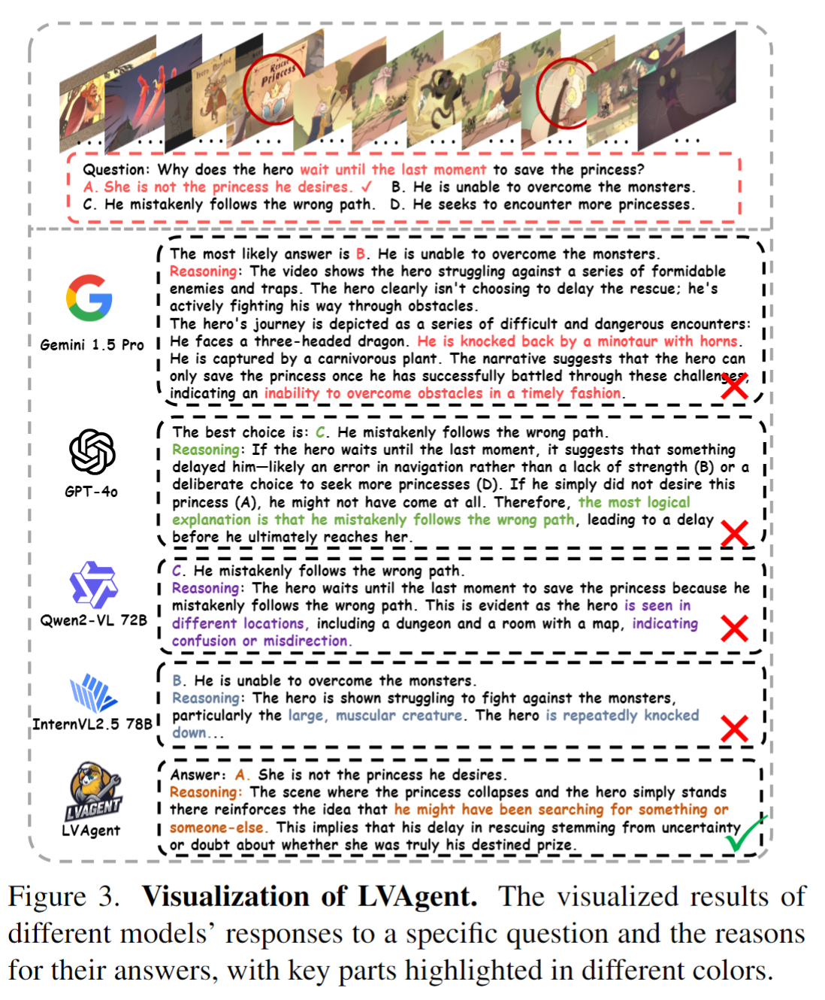
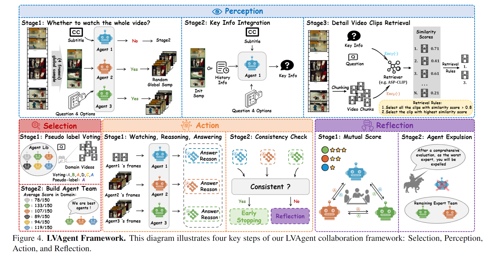
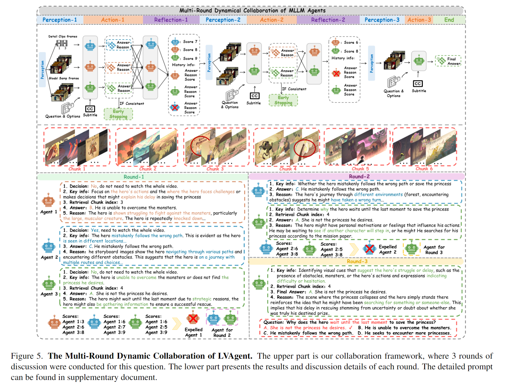

# LVAgent：

Our paper has been accepted by ICCV 2025

## Abstract

- Existing Multimodal Large Language Models (MLLMs) encounter significant challenges in modeling the temporal context within long videos. 
  Currently, mainstream Agent-based methods use external tools (e.g., search engine, memory banks, OCR, retrieval models) to assist a single MLLM in answering long video questions. Despite such tool-based support, a solitary MLLM still offers only a partial understanding of long videos, resulting in limited performance.
  In order to better address long video tasks, we introduce LVAgent, the first framework enabling multi-round dynamic collaboration of MLLM agents in long video understanding.
  Our methodology consists of four key steps: 

  1) Selection: We pre-select appropriate agents from the model library to form optimal agent teams based on different tasks.
  2) Perception: 
    We design an effective retrieval scheme for long videos, improving the coverage of critical temporal segments while maintaining computational efficiency‌.
  3) Action: Agents answer long video-related questions and exchange reasons.
  4) Reflection: We evaluate each agent's performance in each round of discussion and optimize the agent team for dynamic collaboration.
     The agents iteratively refine their answers by multi-round dynamical collaboration of MLLM agents.

  LVAgent is the first agent system method that outperforms all closed-source models (including GPT-4o) and open-source models (including InternVL-2.5 and Qwen2-VL) in the long video understanding tasks.  Our LVAgent achieves an accuracy of 80% on four mainstream long video understanding tasks. Notably, on the LongVideoBench dataset, LVAgent improves accuracy by up to 13.3% compared with SOTA.

## Result:





## Method：









## Install

```bash
conda create -n lvagent python=3.12
pip install -r requirement.txt
```

- Please download the dataset of longvideo bench, videomme, egoschema, mlvu dataset from hugging face
- Download the model Internvl2.5 7B/78B，qwen2VL-7B/72B, LongVU，LLava-video-72B from hugging face
- **Change the path in  discuss_final_lvbench.py, all_model_agent.py and  all_model_util**
- First crtl+F find all the path has '/fs-computility', and then change the path for dataset and model.

### Inference

```bash
bash inference.sh
```

## Citation

```bash
@article{chen2025lvagent,
  title={Lvagent: Long video understanding by multi-round dynamical collaboration of mllm agents,
  author={Chen, Boyu and Yue, Zhengrong and Chen, Siran and Wang, Zikang and Liu, Yang and Li, Peng and Wang, Yali,
  journal={arXiv preprint arXiv:2503.10200,
  year={2025


@article{wang2025videochat,
  title={VideoChat-A1: Thinking with Long Videos by Chain-of-Shot Reasoning,
  author={Wang, Zikang and Chen, Boyu and Yue, Zhengrong and Wang, Yi and Qiao, Yu and Wang, Limin and Wang, Yali,
  journal={arXiv preprint arXiv:2506.06097,
  year={2025

```

